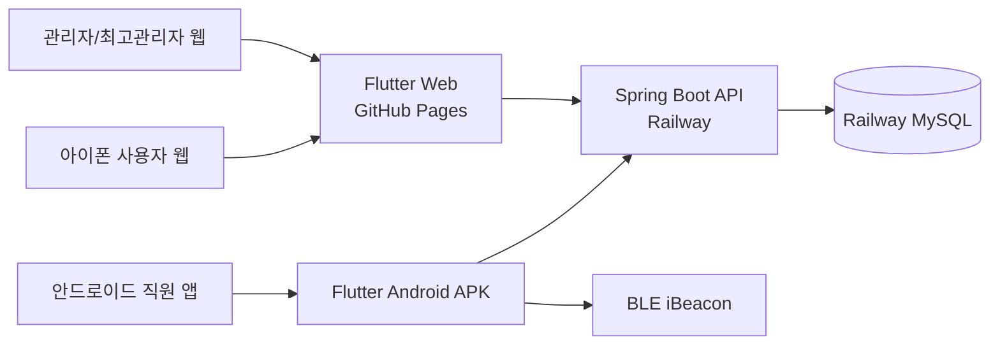
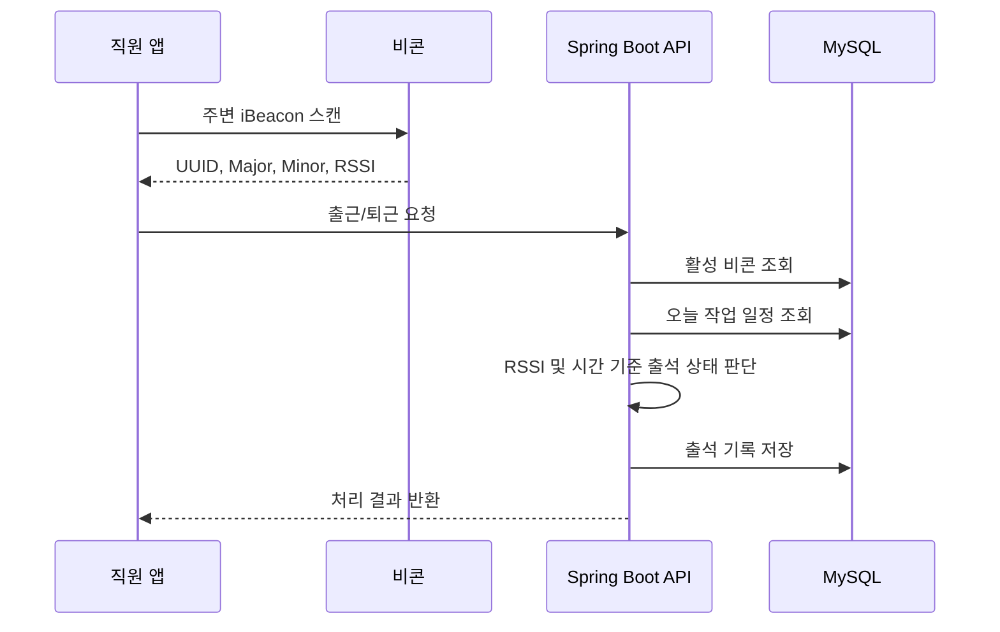

# PFT

Paint Field Tracker. 외벽 페인트 시공 현장의 출퇴근, 작업 일정, 직원, 비콘, 급여 기준을 관리하는 현장 관리 시스템입니다.

관리자는 웹에서 현장, 작업 일정, 직원, 비콘, 출석 기록, 급여 기준을 관리하고, 직원은 모바일 앱에서 비콘 범위 안에 들어왔을 때 출근/퇴근을 처리합니다.

## 배포 주소

- 웹 앱: https://githoeuk.github.io/PFT/
- 백엔드 API: 새 백엔드 배포 후 `API_BASE_URL`로 지정
- API 보호 확인 예시: `/api/v1/admin/**`는 JWT 없이 접근하면 `401 Unauthorized`를 반환합니다.

> 데모 로그인 계정은 공개 저장소에 노출하지 않고 별도로 제공합니다.

## 프로젝트 목표

이 프로젝트는 현장 작업자의 출석을 수기 장부가 아니라 모바일 앱과 서버 API로 관리하기 위해 만들었습니다.

핵심 목표는 다음과 같습니다.

- 직원과 관리자가 하나의 서비스 안에서 역할 기반으로 다른 기능을 사용
- 비콘 UUID, Major, Minor, RSSI를 이용해 현장 접근 여부 검증
- 작업 일정 기준으로 정상 출근, 지각, 조퇴, 결석 상태 관리
- 관리자 수기 수정과 수정 이력 저장으로 출석 데이터의 감사 추적 확보
- 직원별 현장 일급과 세율을 관리해 급여 계산 기반 마련
- 백엔드, 웹, 안드로이드 앱까지 실제 배포 가능한 구조로 구성

## 주요 기능

### 공통

- JWT 로그인
- Refresh Token 기반 자동 로그인
- 로그인 아이디 저장
- 역할 기반 화면 분기
- 마이페이지 조회 및 정보 수정
- 비밀번호 변경
- 아이디 찾기 및 비밀번호 재설정

### 직원

- 비콘 감지 기반 출근
- 비콘 감지 기반 퇴근
- 본인 출석 내역 조회
- 출근/퇴근 결과 확인

### 관리자

- 작업 현장 관리
- 작업 일정 관리
- 비콘 등록 및 수정
- 직원 계정 생성, 수정, 비활성화
- 직원 임시 비밀번호 초기화
- 출석 현황 조건 검색
- 출석 수기 등록 및 수정
- 출석 수정 이력 조회
- 직원별 현장 일급/세율 설정

### 최고 관리자

- 관리자 계정 생성
- 관리자 계정 조회, 수정, 비활성화
- 관리자 비밀번호 초기화

## 기술 스택

### Backend

- Java 21
- Spring Boot 4.1.0
- Spring Security
- JWT
- Spring Data JPA
- Hibernate
- MySQL
- H2
- Gradle
- Lombok

### Frontend / Mobile

- Flutter
- Dart
- Flutter Web
- Android APK
- REST API 연동
- Secure Storage 및 Web localStorage fallback
- Bluetooth Beacon 스캔
- Permission Handler

### Infra / Deployment

- Railway
- Railway MySQL
- GitHub Pages
- GitHub Actions
- Dockerfile

## 시스템 구조



## 출석 처리 흐름



## 출석 판정 기준

출근/퇴근 요청에는 비콘 정보와 RSSI가 포함됩니다.

서버는 다음 순서로 검증합니다.

1. 등록된 활성 비콘인지 확인
2. RSSI가 현장 허용 기준 안에 있는지 확인
3. 비콘이 속한 작업 현장의 오늘 작업 일정 조회
4. 출근/퇴근 시간 기준으로 상태 판정
5. 출석 기록 저장

지원 상태:

| 상태 | 의미 |
| --- | --- |
| `NORMAL` | 정상 출근 |
| `LATE` | 지각 |
| `EARLY_LEAVE` | 조퇴 |
| `LATE_AND_EARLY_LEAVE` | 지각 및 조퇴 |
| `ABSENT` | 결석 |

## 프로젝트 구조

```text
PFT
├── backend
│   ├── src/main/java/com/example/demo
│   │   ├── domain
│   │   │   ├── attendance
│   │   │   ├── auth
│   │   │   ├── beacon
│   │   │   ├── payroll
│   │   │   ├── schedule
│   │   │   ├── user
│   │   │   └── worksite
│   │   └── global
│   │       ├── bootstrap
│   │       ├── common
│   │       ├── config
│   │       ├── exception
│   │       └── security
│   └── docs
├── mobile
│   ├── android
│   ├── ios
│   ├── lib
│   │   ├── core
│   │   └── features
│   └── web
├── docs
└── .github/workflows
```

## 실행 방법

### Backend 로컬 실행

```bash
cd /d D:\demo\PFT\backend
./gradlew.bat bootRun --args='--spring.profiles.active=dev'
```

### Flutter Web 로컬 실행

```bash
cd /d D:\demo\PFT\mobile

flutter run -d chrome \
  --dart-define=API_BASE_URL=http://localhost:8080/api/v1
```

### Flutter Web 배포 빌드

```bash
cd /d D:\demo\PFT\mobile

flutter build web \
  --base-href /PFT/ \
  --dart-define=API_BASE_URL=https://your-pft-backend.example.com/api/v1
```

### Android APK 빌드

```bash
cd /d D:\demo\PFT\mobile

flutter build apk --release \
  --dart-define=API_BASE_URL=https://your-pft-backend.example.com/api/v1
```

빌드 결과:

```text
mobile/build/app/outputs/flutter-apk/app-release.apk
```

## 배포 구성

### Backend

- Railway에서 `backend` 디렉토리를 Root Directory로 설정
- Railway MySQL 연결
- `prod` 프로필 사용
- 환경변수 기반 DB/JWT/CORS 설정
- 최초 배포 시 `SUPER_ADMIN_*` 환경변수로 최고관리자 계정 자동 생성

### Frontend

- GitHub Actions에서 Flutter Web 빌드
- `mobile/build/web` 결과물을 GitHub Pages에 배포
- `main` 브랜치 push 시 자동 배포

### CORS

백엔드에서는 Flutter Web 배포 주소를 CORS 허용 origin에 추가합니다.

```text
https://githoeuk.github.io
```

## 검증 완료 항목

- Railway 백엔드 배포
- Railway MySQL 연결
- Spring Boot `prod` 프로필 실행
- 최초 최고관리자 자동 생성
- GitHub Pages Flutter Web 배포
- 웹 로그인 및 관리자 화면 접속
- 직원 계정 생성
- 안드로이드 APK 빌드
- 실제 비콘 감지

## 한계와 운영 고려사항

- iPhone Safari/일반 웹에서는 iBeacon 스캔 기반 출퇴근을 지원하지 않습니다.
- Android 웹에서도 비콘 스캔은 안정적으로 지원하기 어렵습니다.
- 실제 비콘 출퇴근은 Android APK에서 검증합니다.
- iOS 앱으로 비콘 출퇴근을 지원하려면 Mac과 Xcode 기반 iOS 빌드 환경이 필요합니다.
- Railway 무료 체험/크레딧이 종료되면 운영 서버 이전이 필요합니다.
- Google Play 정식 배포는 Play Console 개발자 등록비와 테스트 조건을 고려해야 합니다.

## 문제 해결 경험

개발 및 배포 과정에서 아래 문제를 직접 해결했습니다.

- Spring Security JWT 필터 적용 후 인증 사용자 정보 주입
- Refresh Token 기반 자동 로그인 구조 추가
- Flutter Web HTTP 환경에서 Secure Storage fallback 처리
- Railway MySQL private networking 연결 실패를 public TCP proxy로 전환
- Railway `PORT` 환경변수 대응
- prod CORS 설정이 Spring Security에 적용되지 않던 문제 해결
- GitHub Pages 배포 시 Flutter Web `base-href` 설정
- Git Bash 경로 변환으로 인한 `base-href` 오류 대응

## 문서

- [Backend README](backend/README.md)
- [Mobile README](mobile/README.md)
- [API 명세](backend/docs/API_SPEC.md)
- [API 컨벤션](backend/docs/API_CONVENTION.md)
- [ERD](backend/docs/ERD.md)
- [서비스 설계](backend/docs/SERVICE_DESIGN.md)
- [테스트 가이드](backend/docs/TEST_GUIDE.md)
- [안드로이드 테스터 설치 및 검증 가이드](docs/android-tester-guide.md)

## 향후 개선 계획

- Android 실기기 추가 테스트 확대
- 실제 현장 기준 RSSI 보정값 수집
- 관리자 대시보드 통계 추가
- 출석 기록 엑셀 다운로드
- 급여 정산 리포트
- 비콘 삭제 정책 및 장기 비활성 데이터 정리
- iOS 앱 빌드 환경 확보 후 iPhone 비콘 출퇴근 지원 검토
