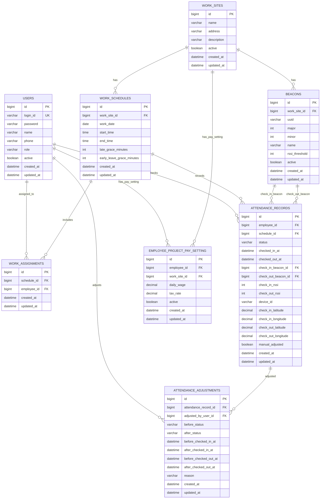

# ERD

## 1. 설계 개요

이 시스템은 관리자와 직원을 하나의 `users` 테이블에서 관리하고, 역할(`ADMIN`, `EMPLOYEE`)로 기능 접근을 분리합니다.

출석 기록은 직원, 작업 일정, 비콘 정보를 기준으로 생성됩니다. 관리자가 수기로 출석을 수정하는 경우 원본 출석 기록을 직접 변경하되, 변경 전후 값은 `attendance_adjustments`에 별도로 저장하여 수정 이력을 추적합니다.

작업 배정(`work_assignments`)은 확장용으로 엔티티와 Repository만 준비되어 있으며, 1차 MVP 출퇴근 로직에서는 사용하지 않습니다.

## 2. ERD



## 3. 테이블 설명

### users

관리자와 직원 계정을 함께 저장합니다.

| 컬럼 | 설명 |
| --- | --- |
| `login_id` | 로그인 아이디, 중복 불가 |
| `password` | BCrypt로 암호화된 비밀번호 |
| `role` | `ADMIN`, `EMPLOYEE` |
| `active` | 비활성화 여부 |

직원 계정은 관리자가 생성하며, 생성 시 임시 비밀번호를 발급합니다.

### work_sites

아파트 페인트 작업 현장을 저장합니다.

예시:

```text
101동 외벽 페인트 작업
```

### beacons

현장에 설치된 비콘 정보를 저장합니다.

| 컬럼 | 설명 |
| --- | --- |
| `uuid` | 비콘 UUID |
| `major` | 현장 또는 그룹 식별 값 |
| `minor` | 현장 내부 비콘 식별 값 |
| `rssi_threshold` | 출석 가능 범위 판정 기준 |
| `active` | 비콘 사용 여부 |

출석 요청의 RSSI가 `rssi_threshold`보다 작으면 출석 가능 범위 밖으로 판단합니다.

### work_schedules

작업 날짜와 기준 출근/퇴근 시간을 저장합니다.

출석 판정 기준:

```text
지각 기준 = start_time + late_grace_minutes
조퇴 기준 = end_time - early_leave_grace_minutes
```

### work_assignments

특정 작업 일정에 직원을 배정하기 위한 확장용 테이블입니다.

현재는 엔티티와 Repository만 유지하고, 1차 MVP 출퇴근 로직에서는 사용하지 않습니다. 현재 출퇴근은 비콘이 속한 현장의 오늘 작업 일정을 기준으로 처리합니다.

### attendance_records

직원의 출근/퇴근 기록과 출석 증빙 데이터를 저장합니다.

관리자가 수기로 출석을 수정해도 다음 데이터는 출석 기록에 남습니다.

```text
checked_in_at
checked_out_at
check_in_beacon_id
check_out_beacon_id
check_in_rssi
check_out_rssi
device_id
latitude
longitude
```

한 직원은 같은 작업 일정에 하나의 출석 기록만 가질 수 있습니다.

### attendance_adjustments

관리자의 출석 수기 수정 이력을 저장합니다.

저장하는 값:

- 수정 대상 출석 기록
- 수정한 관리자
- 수정 전 출석 상태
- 수정 후 출석 상태
- 수정 전 출근/퇴근 시간
- 수정 후 출근/퇴근 시간
- 수정 사유

수기 수정 기능은 출석 신뢰성과 감사 추적을 위해 이력 저장이 필요합니다.

### employee_project_pay_setting

직원별 작업 현장 일급과 세율을 저장합니다.

| 컬럼 | 설명 |
| --- | --- |
| `employee_id` | 직원 ID |
| `work_site_id` | 작업 현장 ID |
| `daily_wage` | 일급 |
| `tax_rate` | 세율, 소수점 둘째 자리까지 허용 |
| `active` | 설정 사용 여부 |

한 직원은 같은 작업 현장에 하나의 활성 급여 설정만 갖도록 설계했습니다.

## 4. 주요 제약 조건

| 테이블 | 제약 조건 | 목적 |
| --- | --- | --- |
| `users` | `login_id` unique | 로그인 아이디 중복 방지 |
| `beacons` | `uuid`, `major`, `minor` unique | 동일 비콘 중복 등록 방지 |
| `work_assignments` | `schedule_id`, `employee_id` unique | 같은 일정에 같은 직원 중복 배정 방지 |
| `attendance_records` | `employee_id`, `schedule_id` unique | 같은 일정 중복 출근 방지 |
| `employee_project_pay_setting` | `employee_id`, `work_site_id` unique | 같은 현장 급여 설정 중복 방지 |

## 5. 주요 인덱스

| 인덱스 | 대상 | 목적 |
| --- | --- | --- |
| `idx_users_login_id` | `users(login_id)` | 로그인 사용자 조회 |
| `idx_beacons_identifier` | `beacons(uuid, major, minor)` | 비콘 식별 조회 |
| `idx_work_schedules_site_date` | `work_schedules(work_site_id, work_date)` | 현장별 오늘 일정 조회 |
| `idx_attendance_records_employee_schedule` | `attendance_records(employee_id, schedule_id)` | 직원의 일정별 출석 기록 조회 |
| `idx_attendance_adjustments_record` | `attendance_adjustments(attendance_record_id)` | 출석 기록별 수정 이력 조회 |
| `idx_pay_settings_employee_work_site` | `employee_project_pay_setting(employee_id, work_site_id)` | 직원/현장 급여 설정 조회 |

## 6. 출석 상태

```text
NORMAL
LATE
EARLY_LEAVE
LATE_AND_EARLY_LEAVE
ABSENT
MANUAL_FIXED
```

## 7. 1차 MVP 범위

구현 완료:

```text
users
work_sites
beacons
work_schedules
attendance_records
attendance_adjustments
employee_project_pay_setting
```

확장용 보류:

```text
work_assignments
```
